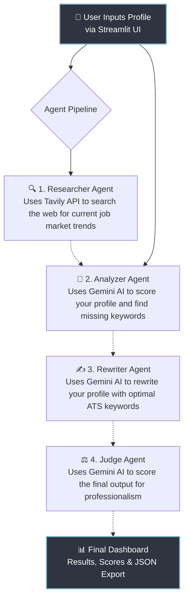

<<<<<<< HEAD
# linkedin-ai-optimizer
"An Enterprise AI agent pipeline powered by Gemini and Tavily that automatically researches, analyzes, and optimizes LinkedIn profiles for maximum ATS visibility and recruiter appeal."
=======
# 🚀 LinkedIn AI Optimizer

An enterprise-grade AI agent pipeline that automatically researches, analyzes, and rewrites your LinkedIn profile to maximize recruiter appeal and Applicant Tracking System (ATS) visibility.


---

## 📖 What is this project?
When applying for jobs, having an optimized LinkedIn profile is critical. This project acts as your personal AI Career Coach. You simply provide your current LinkedIn headline, about section, and skills. The application then uses **Google Gemini 2.5 AI** and live web searches via **Tavily API** to figure out what top recruiters in your field are looking for. It scores your current profile, completely rewrites it to be ATS-friendly, and then independently "judges" the final result to ensure it is top-quality before you paste it onto your real LinkedIn profile.

---

## 🤖 How It Works (The AI Pipeline)

The project uses a **Multi-Agent Architecture**, meaning 4 different AI "personas" work together in a sequence:



---

## 📁 Project Structure Diagram

Here is how the code is organized so you can easily understand the repository:

```text
linkedin-ai-optimizer/
├── agents/
│   ├── __init__.py
│   ├── llm.py            # Centralized LLM logic to call Google Gemini securely
│   ├── researcher.py     # Agent 1: Searches the web for job trends (Tavily API)
│   ├── analyzer.py       # Agent 2: Scores your current profile
│   ├── rewriter.py       # Agent 3: Rewrites and optimizes your profile
│   └── judge.py          # Agent 4: Strict judge that evaluates the final result
├── .env                  # (You create this) Stores your secret API keys
├── app.py                # Main Streamlit Frontend and User Interface
├── requirements.txt      # List of Python packages required to run the app
└── README.md             # This documentation file
```

---

## 🚀 Step-by-Step Setup Guide

Follow these simple steps to run the project on your local machine:

### Step 1: Clone the Repository
Download the code to your local machine:
```bash
git clone https://github.com/your-username/linkedin-ai-optimizer.git
cd linkedin-ai-optimizer
```

### Step 2: Install Dependencies
Install all the required Python libraries using pip:
```bash
pip install -r requirements.txt
```

### Step 3: Setup API Keys
The AI needs API keys to function. Create a new file named `.env` in the root folder and add your keys inside it:
```env
GEMINI_API_KEY=your_gemini_api_key_here
TAVILY_API_KEY=your_tavily_api_key_here
```
*(You can get a free Gemini key from Google AI Studio and a free Tavily key from Tavily.com)*

### Step 4: Run the Application
Start the Streamlit web app:
```bash
streamlit run app.py
```
Your browser will automatically open a beautiful user interface at `http://localhost:8501`. Fill in your job details, and watch the AI optimize your profile!

---

## 🛠️ Technology Stack
- **Frontend**: Streamlit (Python UI Framework)
- **AI Brain**: Google GenAI SDK (`gemini-2.5-flash` model)
- **Web Search**: Tavily Search API
- **Language**: Python 3.10+

## 📝 License
This project is licensed under the MIT License.
>>>>>>> 261846e (Initial commit)
